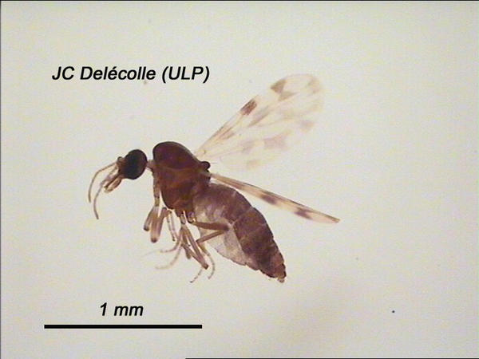
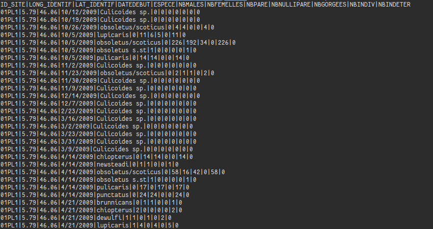

```{r setup, include=FALSE}
knitr::opts_chunk$set(echo = FALSE, cache = TRUE,
               cache.lazy = FALSE)
options(warn=-1)
require(tidyverse)	
require(lubridate)
require(leaflet)
```

## Encore un peu plus loin dans les manipulations de données !
```{r, echo=FALSE, fig.cap="", fig.align='center',out.width = '50%'}
knitr::include_graphics("images/owl.jpg")
```

## Gerer des données temporelles/spatiales

Données d'abondances de cullicoides sur des piègages en France métropolitaine sur plusieurs années.

```{r, echo=FALSE, fig.cap="", fig.align='center',out.width = '60%'}

```

## Import du jeu de données

Format csv ( "Comma" Separated Value) 

```{r, echo=FALSE, fig.cap="", out.width = '90%'}

```

## Import du jeu de données (2)

```{r, echo=T, warning =F}
require(tidyverse)
data = read.csv("data_and_script_part2/uniqDataOcapi.csv",
	sep="|",header=T)
data %>% glimpse			
```

## Gestion des données temporelles
- R propose un type "date" qui permet de faire des operations sur des données de dates & heures
- read.csv ne devine pas que la colonne DATEDEBUT contient des données temporelles (conversion en facteur). 
- Le package lubridate arrive à la rescousse

```{r, echo=FALSE, fig.align='center', out.width = '30%'}

```

## Exemple simple de conversion de chaines de charactère

```{r, echo =T,collapse = TRUE}
dmy("08 September 1980")
dmy("08/09/1980")
dmy("08-9-80")
mdy("09.08.1980")
mdy_hms("09/9/80 10:05:00")

```

## Extraction des infos depuis les variables de type "date"
```{r, echo =T,collapse = TRUE}
bd = mdy_hms("09/9/80 10:05:00")
hour(bd)
year(bd)
month(bd)
month(bd,label=T)
month(bd,label=T,abbr=F)
month(bd,label=T,abbr=F,locale="en_US.utf8")


```

## Exemple d'arithmétique temporelle

```{r, echo =T,collapse = TRUE}
bd
now()
diff = now() - bd
as.period(diff) 
as.duration(diff)
bd + months(1:9)
```

## Intervalles 

```{r, echo =T,collapse = FALSE}
interval(bd,now())
interval(bd,now()) %>%  as.duration
shit <- mdy("09/11/2001")
shit %within% interval(bd,now())
```

## Conversion des dates dans notre jeu de données
```{r ,echo =T, warning=F}
td = data %>%
  mutate(date = mdy(DATEDEBUT)) %>% mutate(month = month(date)) %>% mutate(year=year(date)) %>% 
      select(ID_SITE,LONG_IDENTIF,LAT_IDENTIF,DATEDEBUT,date, month,year,ESPECE,NBINDIV)
td %>% glimpse
```

## Exploration des données d'abondance au cours du temps
```{r ,echo =T, warning=F,fig.height=4}
td %>%  ggplot() + geom_boxplot(aes(group = year , x=date,y= NBINDIV))  +
scale_y_log10() + theme_bw() 
```


## Exploration des données d'abondance au cours du temps
```{r ,echo =T, warning=F,fig.height=4}
td  %>% ggplot() + geom_boxplot(aes(x=month(date,label=T),y= NBINDIV))  +
scale_y_log10() + theme_bw() + xlab("Mois de l'annéee") + ylab("Nombre d'individus")
```

## Exploration des données d'abondance au cours du temps
```{r ,echo =T, warning=F,fig.height=3}
td  %>% ggplot() + 
  geom_boxplot(aes(fill=as.factor(year),x=month(date,label=T),y= NBINDIV)) + 
  scale_y_log10() + theme_bw() + 
  xlab("Mois de l'annéee") + ylab("Nombre d'individus") + 
  scale_fill_discrete(name="année")
```

## Exploration des données d'abondance au cours du temps

```{r ,echo =T, warning=F}
abundant = td %>% group_by(ESPECE) %>% 
  summarize(mean = mean(NBINDIV)) %>% 
  top_n(.,3) %>%  arrange(desc(mean))
abundant
```

## Filtre et représentation finale
```{r ,echo =T, warning=F,results="hide"}
td %>% 
  filter(ESPECE %in% abundant$ESPECE)  %>% 
  filter(date %within%interval(dmy("1/1/2009"),dmy("31/12/2011"))) %>% 
  ggplot()+ 
  geom_boxplot(aes(fill=ESPECE,x=month(date,label=T),y= NBINDIV ),position="dodge") +
  scale_y_log10() +  
  scale_fill_brewer(palette = "Set2") + 
  theme_bw() + 
  facet_wrap(~ year, ncol=1, scale="free") + 
  xlab("mois") + ylab("individus")
```

## Filtre et représentation finale
```{r ,echo =F, warning=F,fig.height=5,size="small"}
td %>% 
  filter(ESPECE %in% abundant$ESPECE)  %>% 
  filter(date %within%interval(dmy("1/1/2009"),dmy("31/12/2011"))) %>% 
  ggplot()+ 
  geom_boxplot(aes(fill=ESPECE,x=month(date,label=T),y= NBINDIV ),position="dodge") +
  scale_y_log10() +  
  scale_fill_brewer(palette = "Set2") + 
  theme_bw() + 
  facet_wrap(~ year, ncol=1, scale="free") + 
  xlab("mois") + ylab("individus")
```

## Filtre et représentation finale
```{r ,echo =T, warning=F,results="hide"}
td %>% 
  filter(ESPECE %in% abundant$ESPECE)  %>%  
  filter(date %within%interval(dmy("1/1/2009"),dmy("31/12/2013"))) %>% 
  ggplot()+ 
  geom_violin(aes(fill=ESPECE,x=month(date,label=T),y= NBINDIV ),position="dodge") +
  scale_y_log10() +  
  scale_fill_brewer(palette = "Set2") + 
  theme_bw() + 
  facet_wrap(~ year, ncol=1, scale="free") + 
  xlab("mois") + ylab("individus")
```

## Filtre et représentation finale
```{r ,echo =F, warning=F,fig.height=5,size="small"}
td %>% 
  filter(ESPECE %in% abundant$ESPECE)  %>% 
  filter(date %within%interval(dmy("1/1/2009"),dmy("31/12/2013"))) %>% 
  ggplot()+ 
  geom_violin(aes(fill=ESPECE,x=month(date,label=T),y= NBINDIV ),position="dodge") +
  scale_y_log10() +  
  scale_fill_brewer(palette = "Set2") + 
  theme_bw() + 
  facet_wrap(~ year, ncol=1, scale="free") + 
  xlab("mois") + ylab("individus")
```

## Données spatiales

*ouch* Il y a deux ans, on pouvait encore utiliser gratuitement l'API de google maps.
C'est fini. 

On va appeller leafleat a la rescousse. 

https://rstudio.github.io/leaflet/
```{r fig.height=4, warning=FALSE, ,echo=T, size="small"}
m <- leaflet() %>% addTiles()
m
```

## Données spatiales
```{r fig.height=4, warning=FALSE, ,echo=T, size="small"}
leaflet() %>% addProviderTiles(providers$CartoDB.Positron) %>% 
  setView(mean(td$LONG_IDENTIF,na.rm=T),mean(td$LAT_IDENTIF,na.rm=T),zoom = 5)
```

## Données spatiales
```{r fig.height=4, warning=FALSE, ,echo=T, size="small"}
td %>% leaflet() %>% addProviderTiles(providers$CartoDB.Positron) %>% 
  setView(mean(td$LONG_IDENTIF,na.rm=T),mean(td$LAT_IDENTIF,na.rm=T),zoom = 5) %>% 
  addCircles(lat= ~LAT_IDENTIF,lng= ~LONG_IDENTIF,radius=20,
                 stroke=T,
                 fillOpacity = 0.7)
```

## Données spatiales
```{r fig.height=4, warning=FALSE, ,echo=T, size="small"}
cd = td %>% 
  filter(ESPECE %in% abundant$ESPECE)  %>%  
  filter(date %within%interval(dmy("1/1/2009"),dmy("31/12/2013"))) %>% 
  group_by(ID_SITE,ESPECE,LONG_IDENTIF,LAT_IDENTIF,) %>% summarize(capture = mean(NBINDIV))
cd
```

## Données spatiales
```{r fig.height=4, warning=FALSE, echo=T, size="small"}
pal = colorFactor(c('#1b9e77','#d95f02','#7570b3'),domain=cd$ESPECE %>% droplevels)
cd %>% 
leaflet() %>% addProviderTiles(providers$CartoDB.Positron) %>% 
setView(mean(td$LONG_IDENTIF,na.rm=T),mean(td$LAT_IDENTIF,na.rm=T),zoom = 5) %>% 
addCircles(lat= ~LAT_IDENTIF,lng= ~LONG_IDENTIF,radius=~20*capture,
                 stroke=F,
                 fillOpacity = 0.5,
                 color=~pal(ESPECE)) %>% 
addLegend(pal=pal,values= ~ESPECE)
```


<!-- ## Données spatiales -->
<!-- ```{r fig.height=4, warning=FALSE, echo=F,results=T, size="small"} -->
<!--  pal = colorFactor(c('#1b9e77','#d95f02','#7570b3'),domain=cd$ESPECE %>% droplevels)  -->
<!--   cd %>%  -->
<!--   leaflet() %>% addProviderTiles(providers$CartoDB.Positron) %>%  -->
<!--   setView(mean(td$LONG_IDENTIF,na.rm=T),mean(td$LAT_IDENTIF,na.rm=T),zoom = 5) %>%  -->
<!--   addCircles(lat= ~LAT_IDENTIF,lng= ~LONG_IDENTIF,radius=~20*capture, -->
<!--                  stroke=F, -->
<!--                  fillOpacity = 0.5, -->
<!--                  color=~pal(ESPECE)) %>%  -->
<!--   addLegend(pal=pal,values= ~ESPECE) -->
<!-- ``` -->


